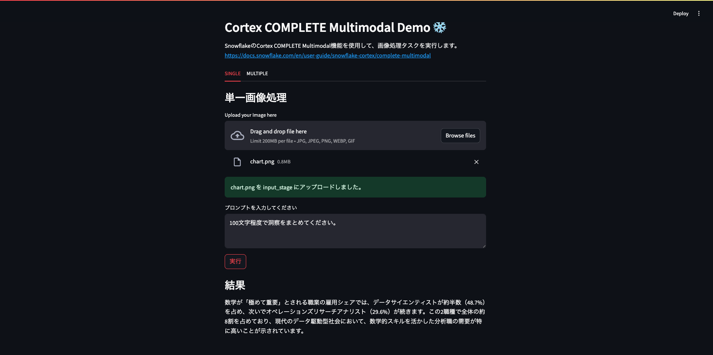

# Snowflake CortexAIの新機能 Cortex COMPLETE Multimodalを触ってみた

## はじめに
こんにちは、AIコンサルティンググループの桝田修慎です。
SnowflakeはクラウドDWHにとどまらず、AI活用における強力な基盤へと進化しています。
Snowflakeでは生成AIの機能群としてCortex AIを提供しており、その中でも2025年4月にパブリックプレビューになったCOMPLETE Multimodal機能は、Snowflakeでビジョンタスクの実行を可能にしました。
そこで今回は、新機能であるCortex COMPLETE Multimodalを使った簡易的な画像処理アプリケーションを作成してみます。

## Cortex COMPLETE Multimodalとは
ユーザーからの画像とプロンプト入力に対して、言語モデルを用いて応答を生成できる機能のことです。
Snowflakeの内部・外部ステージに画像をアップロードすることで、単一・複数の画像を処理し結果を返すことが可能になります。

### モデル
`claude-3-5-sonnet`と`pixtral-large`が利用可能です。
トークン数や取り扱えるファイルの種類などに違いがあります。

### 入力要件
| 要件             | 値                                   |
|------------------|----------------------------------------|
| ファイル名拡張子 | `.jpg`, `.jpeg`, `.png`, `.webp`, `.gif` |
| ステージ暗号化   | サーバー側の暗号化                     |
| データ型        | ファイル                          |
※執筆時点(2025/05/26)では、`pixtral-large`のみ、追加で`.bmp`に対応しています。

### 使い方
#### 画像を保存するためのステージを作成します。
[内部ステージの場合]
```
CREATE OR REPLACE STAGE input_stage
    DIRECTORY = ( ENABLE = true )
    ENCRYPTION = ( TYPE = 'SNOWFLAKE_SSE' );
```
[外部ステージの場合]
```
CREATE OR REPLACE STAGE input_stage
    URL='s3://<s3-path>/'
    CREDENTIALS=(AWS_KEY_ID=<aws_key_id>
    AWS_SECRET_KEY=<aws_secret_key>)
    ENCRYPTION=( TYPE = 'AWS_SSE_S3' );
```
#### 単一画像に対してタスクを実行する場合
```
SELECT SNOWFLAKE.CORTEX.COMPLETE('claude-3-5-sonnet',
    'Summarize the insights from this pie chart in 100 words',
    TO_FILE('@myimages', 'science-employment-slide.jpeg'));
```

#### 複数画像に対してタスクを実行する場合
※執筆時点(2025/05/26)では、複数画像処理に対応しているのは`claude-3-5-sonnet`のみです。
```
SELECT SNOWFLAKE.CORTEX.COMPLETE('claude-3-5-sonnet',
    PROMPT('Compare this image {0} to this image {1} and describe the ideal audience for each in two concise bullets no longer than 10 words',
    TO_FILE('@myimages', 'adcreative_1.png'),
    TO_FILE('@myimages', 'adcreative_2.png')
));
```

### リージョン
執筆時点(2025/05/26)ではAWSの一部リージョンのみ利用できます。
| 関数（モデル）           | AWS 米国西部 2（オレゴン） | AWS 米国東部 1（バージニア州北部） | AWS ヨーロッパ セントラル 1（フランクフルト） |
|--------------------------|-----------------------------|-------------------------------------|------------------------------------------------|
| 完了<br>(claude-3-5-sonnet)  | ✓                           | ✓                                   |                                                |
| 完了<br>(pixtral-large)     | ✓                           | ✓                                   | ✓                                              |

https://docs.snowflake.com/en/user-guide/snowflake-cortex/complete-multimodal


### 利用技術
本アプリケーションでは、Snowflake Cortex COMPLETE Multimodal を活用した画像処理を、Streamlit と Snowpark for Python を組み合わせて実現しました。それぞれの技術スタックは以下の役割を担っています。

#### Snowflake Cortex COMPLETE Multimodal
 - Claude 3.5 Sonnetなどの大規模マルチモーダルモデルをSnowflake内から直接呼び出し
 - 画像と言語の統合処理（キャプション生成・比較など）を実行

#### Snowpark for Python
- Snowflakeとの安全なセッション管理
- SQLコマンドをPythonで実行
- Snowflake内部ステージへのファイルアップロード
- Cortex関数の実行と結果の取得

#### Streamlit
- ローカル画像を簡単に選択してアップロード
- 画像に対する自然言語の指示をGUI上で記述
- Cortexからの応答を即座に可視化
- 単一画像処理／複数画像比較をタブで切り替え

## 実装
今回は単一画像と複数画像(2枚)の処理タスクを実施できるように実装していきます。
以下実装のポイントのみ記載しています。

### 完成イメージ


### Snowpark Pythonによるセッション作成、Snowflakeオブジェクト作成、ファイルアップロード
`snowflake.snowpark`の`Session`を使ってセッションを作成します。
```
def get_snowpark_session():
    connection_parameters = {
    "account": os.environ["SNOWFLAKE_ACCOUNT"],
    "user": os.environ["SNOWFLAKE_USER"],
    "password": os.environ["SNOWFLAKE_PASSWORD"],
    }
    return Session.builder.configs(connection_parameters).create()
```
`sql()`を使ってデータベース・スキーマ・ウェアハウス・(内部)ステージを作成します。ステージ作成時はディレクトリテーブルの有効化、暗号化のタイプを指定しましょう。
```
def init_snowflake_object(session):
    db = os.environ["SNOWFLAKE_DATABASE"]
    schema = os.environ["SNOWFLAKE_SCHEMA"]
    stage = os.environ["SNOWFLAKE_STAGE"]
    wh = os.environ["SNOWFLAKE_WAREHOUSE"]
    
    sql_statements = [
        f"CREATE OR REPLACE DATABASE {db};",
        f"CREATE OR REPLACE SCHEMA {db}.{schema};",
        f"CREATE OR REPLACE WAREHOUSE {wh};",
        f"USE DATABASE {db};",
        f"USE SCHEMA {schema};",
        f"USE WAREHOUSE {wh};",
        f"""
            CREATE OR REPLACE STAGE {stage}
                DIRECTORY = ( ENABLE = true )
                ENCRYPTION = ( TYPE = 'SNOWFLAKE_SSE' );
        """
    ]
    for sql in sql_statements:
        session.sql(sql).collect()
```
`PUT`コマンドを使って、前手順で作成した内部ステージへファイルをアップロードします。
```
put_sql = f"""
    PUT 'file://{tmp_file_path}'
    @{os.environ["SNOWFLAKE_DATABASE"]}.{os.environ["SNOWFLAKE_SCHEMA"]}.{os.environ["SNOWFLAKE_STAGE"]}
    AUTO_COMPRESS=FALSE
    OVERWRITE=TRUE
"""
result = session.sql(put_sql).collect()
```

### Streamlitによる画面作成
Streamlitの`tabs`を使って、2つのモードを切り替えられるようにします。
```
import streamlit as st
from dotenv import load_dotenv

from snowflake.session_manager import get_snowpark_session
from snowflake.object_initializer import init_snowflake_object
from mode.single import single_image
from mode.multiple import multiple_images

def init_page():
    st.set_page_config(
        page_title="Cortex COMPLETE Multimodal Demo", 
        page_icon="❄️"
    )
    st.header("Cortex COMPLETE Multimodal Demo ❄️")
    st.markdown("""
        SnowflakeのCortex COMPLETE Multimodal機能を使用して、画像処理タスクを実行します。
        https://docs.snowflake.com/en/user-guide/snowflake-cortex/complete-multimodal
    """)

def main():

    init_page()
    
    if "session" not in st.session_state:
        session = get_snowpark_session()
        init_snowflake_object(session)
        st.session_state["session"] = session

    tabs = st.tabs(["SINGLE", "MULTIPLE"])    

    with tabs[0]:
        single_image()
    with tabs[1]:
        multiple_images()
        pass

if __name__ == "__main__":
    main()
```

### Cortex COMPLETE Multimodalによる画像処理
単一画像の場合：Streamlitからユーザーの入力を受け取り、`COMPLETE`に与えて処理を実行します。モデルは`calude-3-5-sonnet`を使います。
```
user_prompt = st.text_area("プロンプトを入力してください", "100文字程度でキャプションを生成してください。")
if st.button("実行", key="single_image"):
    try:
        with st.spinner("処理中..."):
            result = session.sql(f"""
                SELECT SNOWFLAKE.CORTEX.COMPLETE('claude-3-5-sonnet',
                '{user_prompt}',
                TO_FILE('@{os.environ["SNOWFLAKE_STAGE"]}', '{os.path.basename(tmp_file_path)}'));
            """
            ).collect()
            st.subheader("結果")
            st.write(result[0][0])
    except Exception as e:
        st.error(f"処理中にエラーが発生しました: {e}")
```
複数画像(2枚)の場合：アップロードしたファイルの情報をリストで保持しているので、それぞれ`TO_FILE`に引数として与えます。
```
user_prompt = st.text_area("プロンプトを入力してください", "2つの画像の違いを説明してください。")
if st.button("実行", key="multiple_images"):
    try:
        with st.spinner("処理中..."):
            result = session.sql(f"""
                SELECT SNOWFLAKE.CORTEX.COMPLETE('claude-3-5-sonnet',
                PROMPT('2つの画像 {{0}} と {{1}} に対し、ユーザーの指示に従って処理してください。指示は次の通りです: {user_prompt}',
                TO_FILE('@{os.environ["SNOWFLAKE_STAGE"]}', '{os.path.basename(file_path[0])}'),
                TO_FILE('@{os.environ["SNOWFLAKE_STAGE"]}', '{os.path.basename(file_path[1])}')));
            """
            ).collect()
            st.subheader("結果")
            st.write(result[0][0])
    except Exception as e:
        st.error(f"処理中にエラーが発生しました: {e}")
```

## 完成品
### デモ：単一画像処理
<video controls width="640">
  <source src="media/single.mov">
  Your browser does not support the video tag.
</video>
入力画像は円グラフで、「100文字程度でキャプションを生成してください。」という指示に対して、いい感じにキャプションを生成できました。ちなみに回答本文に含まれる数字は正しく抽出できていました。

### デモ：複数画像処理
<video controls width="640">
  <source src="media/multi.mov">
  Your browser does not support the video tag.
</video>
入力画像2枚はどちらも車とキャッチコピーが書かれている広告で、色合いなどが異なります。「2つの画像の違いを説明してください」という指示に対して、違いの説明文をしっかりと生成できているようです。キャッチコピーも正しく抽出し、それぞれの違いについてしっかりと言及できました。

## まとめ
SnowflakeのCortex COMPLETE Multimodalを使って、画像とテキストの統合処理を手軽に実現できるアプリケーションを作成しました。Snowflakeの既存機能はもちろん、他のAIとの組み合わせなどで、さらに賢く便利な仕組みを作れそうですね。

執筆
AITC AIコンサルティンググループ
桝田 修慎